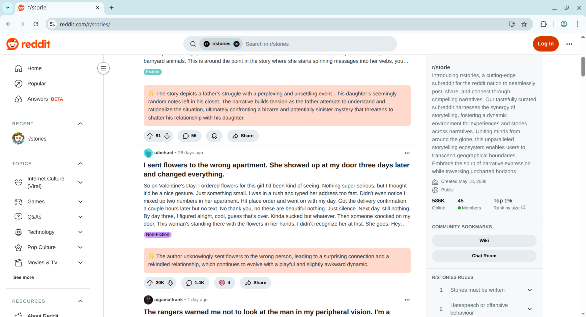

# Reddit post summarizer
Chrome extension that summarizes Reddit posts automatically while you are scrolling using local Ollama server

## Installation

1. Clone this repository
2. Open `chrome://extensions` in Chrome
3. Enable "Developer mode"
4. Load this repository as unpacked extension
5. Run `source launch_ollama.sh` (Bash) or `. .\launch_ollama.ps1` (PowerShell)
6. You can select model you want to use from `chrome-extension://<loaded extension id>/options.html`

## Example

